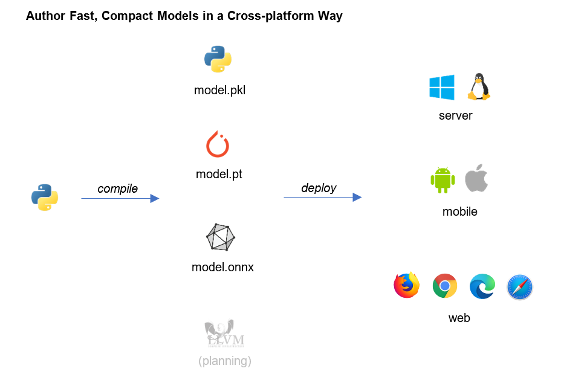

=============================
Python Inference Script(PyIS)
=============================

Python Inference Script is a Python package that enables developers to author machine learning workflows in Python and deploy without Python.

Various tools could be available for fast experimentation, for example sklearn, CNTK, Tensorflow, PyTorch and etc. However, when it comes to deployement, problems will emerge:

* Is it optimized, fast or memory efficient?
* Is the runtime or model compact enough for edge devices?
* Is it easy to learn and cross-platform?

To solve those puzzles, the Python Inference Script(PyIS) is introduced.

Installation
============================

.. code:: bash

    python -m pip install pyis-python --upgrade

Verification
============================

.. code:: python

    import torch
    import pyis
    from typing import List

    class Tokenizer(torch.jit.ScriptModule):
        def forward(self, q: str) -> List[int]:
            tokens = pyis.text.BertTokenizer(q)
            return tokens

    m = Tokenizer()

    # save for onnxruntime
    pyis.onnx.save(m, 'model.onnx')

    # save for libtorch
    pyis.torch.save(m, 'model.pt')

Build the Docs
=============================

Run the following commands and open ``docs/_build/html/index.html`` in browser.

.. code:: bash

    pip install sphinx myst-parser sphinx-rtd-theme sphinxemoji
    cd docs/

    make html         # for linux
    .\make.bat html   # for windows
