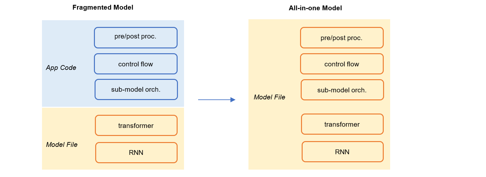

===========================
Why We Build PyIS
===========================

All-in-one Model
=================

When we talk about a model, we most likely mean a neural network graph that transforms input tensors into output tensors, due to the popularity of deep learning methods in recent years. As a result, it is necessary to answer what is a model or what is the boundary between model and application business logics at the very beginning.

In this project, we want the model to cover the end-to-end process from original input to final result. Looking from the model management perspetive, we prefer All-in-one Model to Fragmented Model during authoring and inference.

    All in One Model

Firstly, the data processing steps before and/or after the core neural network graph should be part of the model itself. This is in contract to writing data processing logics in the business code of an application with specific programming language, while authoring the neural network part in Python with TensorFlow or PyTorch.

.. code:: python

    # preprocessing: transform text query to a list of word ids(integer)
    tokens = GPT2Tokenizer(query)
    ids = VocabLookUp(tokens)

    # neural network: output the probabilities over label ids(integer)
    prob = NNModel(ids)

    # postprocessing: transform label id to text
    label = IDToLabel(prob)

Secondly, the glue logics that orchestrate several sub-models should be part of the model itself.

.. code:: python

    language = self.lang_detect_model.run(query)

    if language == 'en-us':
        result = self.enus_model.run(query)
    elif language == 'fr-fr':
        result = self.frfr_model.run(query)
    elif language == 'zh-cn':
        result = self.zhcn_model.run(query)
    else:
        result = self.enus_model.run(query)

Finally, both neural networks, classic statistical and rule-based models should be supported. They are all models. Over the past several years, although neural networks have become the promising choice for almost all machine learning problems, classic models like SVM, LR and GBDT, are still there due to their simplicity, efficiency and legacy reasons.

.. code:: python

    # classic model
    model1 = LinearSVMModel(file='./model/svm.bin')

    # rule-based model
    model2 = Trie(file='./model/allow_list.txt')

    # deep model
    model3 = ONNXModel(file='./model/lstm.onnx')

Data Driven
==============

No matter where a model is deployed, server-side or client-side, upgrading models via data or configuration files is superior to binaries. With the later case, we will have to build a new version of the whole application to deploy every time we want a model update.

From Training to Inference
==============================

How do we reuse code between training and inference?

How do we generate binaries that are needed for inference?

.. code:: python

    class Model:
        def __init__(self):
            # Problems: where are the binary files from?
            self.ngram_extractor = NGramExtractor(bin='./ngram.bin', n=3)
            self.classifer = SVMClassifier(weights='./svm_weights.bin')
        
        def transform(self, query: str) -> int:
            ngrams = self.ngram_extractor(query)
            label = self.classifer(ngrams)
            return label

    ngram_extractor = NGramExtractor()
    ngram_extractor.fit(queries)
    ngrams = ngram_extractor.transform(queries)
    ngram_extractor.save(bin='./ngram.bin')

    svm = SVMClassifier()
    svm.fit(features, expected_lables)
    svm.save(weights='./svm_weights.bin')
